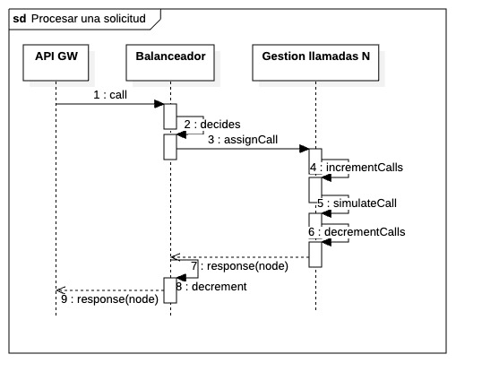
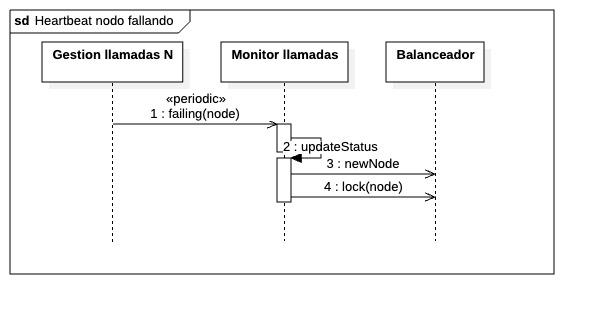
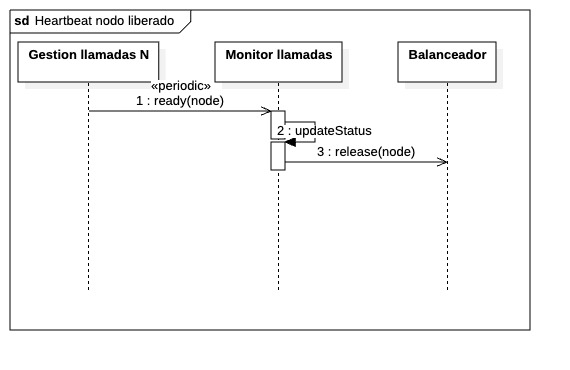

## Getting Started

1. Clone this repository
2. Create a virtual environment: `python -m venv .venv`
3. Activate virtual environment `source .env/bin/activate`
4. Install dependencies: `pip install -r requirements.txt`

## Endpoints

| Component        | Port      | Endpoint                   | Request | Response |
|------------------|-----------|----------------------|---------|----------|
| API GW           | 5000      |`POST call`                | `{ "client": <string> }` | Same as Balanceador |
| Balanceador      | 5001      | `POST /assign-call`        | Same as API GW | Same as Gestion Llamadas |
| Balanceador      | 5001      | `POST /nodes` | Nothing    | `{ "node": <string> }` |
| Balanceador      | 5001      | `PATCH /nodes/{nodeNname}` | `{ "status": <boolean> }` `true` for release node. `false` for lock | Nothing |
| Monitor          | 5002      | `POST /report-status`      | `{ "node": <string>, "status": <boolean> }` `true` means the node is available | Nothing with status code 202 |
| Gestion Llamadas | Starting from 5051 | `POST /process-call`       | Same as API GW | `{ "node": <string> }` |

### Diagrams

| Activity                | Image                                                        |
|-------------------------|--------------------------------------------------------------|
| Process a request       |                  |
| Heartbeat failing node  |    |
| Heartbeat node released |  |
